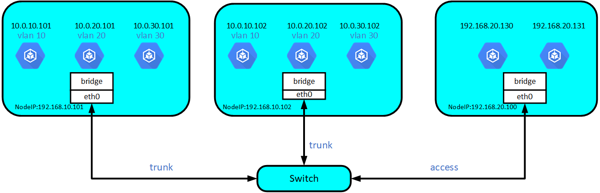
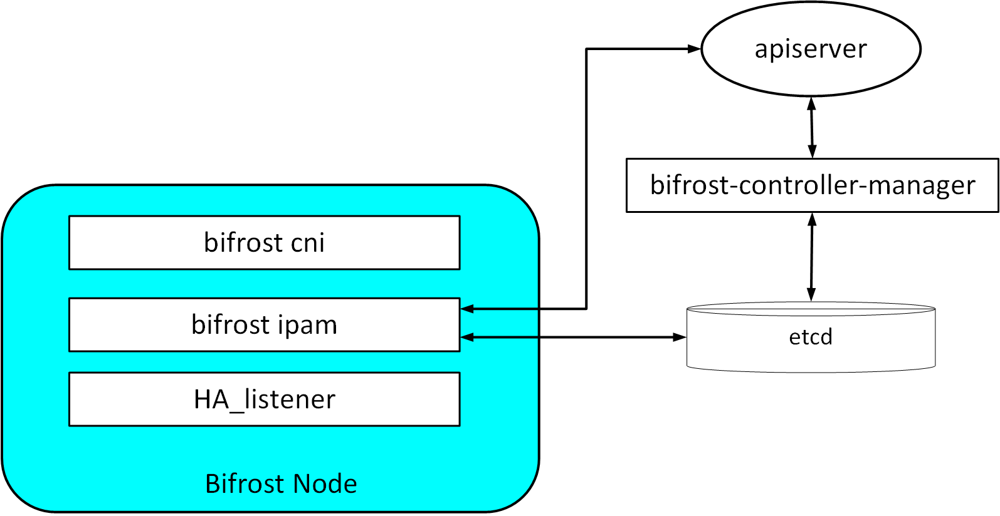

# **Kube-Bridge**

Kube-bridge is an open source solution enabling L2 network for kubernetes. The network traffic in HC-bridge can be managed and monitored by traditional devices.

## **Overview**

## **Features**
network-topology.png
- **L2 network for kubernetes**
- **Flexible IP address management** 
  - Two layer IP pools - namespace IP pool and service IP pool.
  - Static IP for statefulsets.
  - Annotation based IP assignment.
  - Automatic retrieve abnormal IP.
- **VLAN support**

## **Components**

- **Kube-Bridge cni** - CNI plugin responsible for creating and configuring linux bridge on the host.
- **Kube-Bridge ipam** - Component responsible for IP address assignment, using ETCD for storage. 
- **network-controller** - Component providing IP pool configuration [restful APIs](docs/APIOverview.md) and listening for kubernetes APIServer events to retrieve abnormal IPs.
- **HA Daemon** - Component  monitoring bonding NICs' switch on the host in high availability network environment and making physic network devices aware of the NIC's switch. 

## **Getting started** 

 [Getting started](docs/GettingStarted.md)
